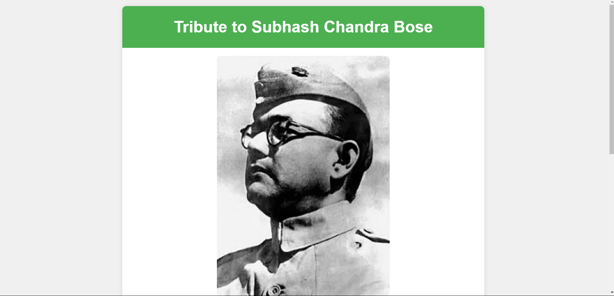

# Codsoft Level 2 Task 1 - Tribute Page

## Project Overview
This project is a tribute page created as part of the CodSoft web development internship. The task was to create a visually appealing webpage dedicated to someone you admire, using HTML and CSS.

## Project Details
- **Task**: Create a Tribute Page
- **Technologies Used**: HTML, CSS

## Features
- Admirable qualities of the person
- Images
- Visually appealing layout
- Experimentation with font styles, paragraphs, and background colors

  ## How to Use

1. **Clone the Repository**:
https://github.com/Nayeem-stud/codesoft-L2-T1-Tribute-page.git

3. **Navigate to the Project Directory**:
cd codsoft-L1-T1-landingpage

4. **Open index.html in Your Browser**:
open index.html

## Live Demo
Check out the live demo of the landing page [here]((https://codesoftl2t1.netlify.app/).

## Conclusion
This project was a great way to apply basic HTML and CSS skills in a practical setting. It challenged me to think about layout, design, and user experience. I look forward to more advanced projects in the future.

## Contact
If you have any questions or suggestions, feel free to reach out to me at abdul3133@gmail.com.

**Image File**: 

